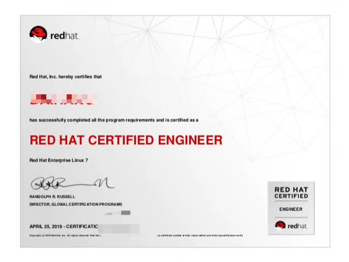

# 🤔 关于我

> **Hello，这里 *李明*，也可以叫我** **diudiu**
> 
> 一位愚蠢的、不断进步的、闲不下来的创业者。

## 🎯 爱好

> - **漫游次元**：追番、打游戏（肥宅常见的爱好啦～） · [追番记录](https://blog.diudiudevil.cn/bangumi/)
> - **代码世界**：编程（纯热爱，但是绝对不要成为工作）
> - **光影艺术**：摄影
> - **户外探索**：露营

## 💼 职业历程

> **~软件实施/运维工程师~** · **（已提桶跑路）**
> 
> **~软件产品经理~** · **（已提桶跑路）**
> 
> **~COSPALY行业相关创业~** · **（已提桶跑路）**

## 🛠️ 技能栈

> - **编程**：热爱但不做饭碗
> - **网络**：折腾过各种NAS与路由
> - **LINUX**：喜欢折腾服务器
> 
> 

  
👋 感谢你的来访！希望在这里能找到对你有用的内容！

